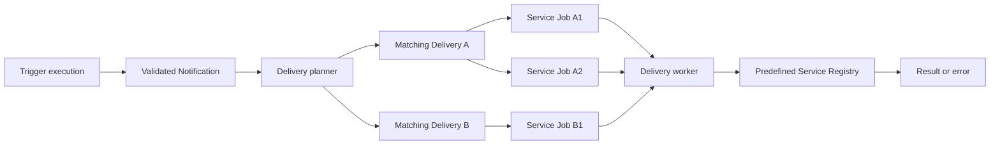

# Delivery Architecture

## Overview

Delivery is the second half of the Trigger system.

Trigger code produces a validated Notification:

```ts
{
  message: string,
  data: JSONValue,
}
```

A Delivery subscribes to one Trigger and sends each new Notification through
one or more predefined Delivery Services.

```text
Trigger execution
    -> Notification
    -> Delivery
    -> Configured Delivery Services
    -> Delivery Jobs
```

Delivery does not run arbitrary creator-provided delivery code. Delivery
Services are implemented and registered by the platform. Creators configure
those services with fixed values and Notification-driven templates.

This document intentionally describes the smallest useful architecture. More
advanced routing, retries, revisions, and policies should be added only when a
real use case requires them.

## Implementation status

The Delivery core described here is implemented. It includes SQLite planning,
the durable worker queue, recursive templates, service schema validation, and
the management APIs. The production adapters are `codex-cli`, which uses the
official TypeScript SDK; `codex-app-server`, which submits through a managed
Codex app-server process; and `codex-app`, which submits through a dedicated
window in the locally authenticated Codex desktop app.

## Codex CLI Delivery Service

The `codex-cli` service runs one local Codex turn for every Delivery Job.

Fixed configuration:

```ts
type CodexCliConfig = {
  projectPath: string
  newThread: boolean
  threadId?: string
  model: "luna" | "terra" | "sol"
  reasoningEffort: "low" | "medium" | "high" | "xhigh" | "max" | "ultra"
  sandboxMode?: "read-only" | "workspace-write" | "danger-full-access"
  networkAccessEnabled?: boolean
  timeoutMs?: number
}
```

Dynamic input:

```ts
type CodexCliInput = {
  prompt: string
  images?: string[]
}
```

The model aliases currently map to `gpt-5.6-luna`, `gpt-5.6-terra`, and
`gpt-5.6-sol`. `sandboxMode` defaults to `danger-full-access`. Omitting
`timeoutMs` means the Codex run has no adapter timeout.

An empty `projectPath` uses the host-managed
`data/trigger/codex-workspace` directory and skips the Git repository check.
Non-empty paths must point to an existing project directory.

Thread behavior is:

- `newThread: true` creates a new Codex thread for every Notification and
  ignores `threadId`.
- `newThread: false` with `threadId` resumes that thread.
- `newThread: false` without `threadId` creates a thread on the first job,
  persists its ID into the configured target, and resumes it on later jobs.

Calls for one configured target are serialized so two Notifications cannot
create competing first threads or write to one thread concurrently. The
adapter inherits the device's existing Codex authentication and uses approval
policy `never` because Delivery Jobs cannot answer interactive prompts.

The job waits until the Codex turn exits so the host does not leave an unmanaged
process. The final Codex response, transcript, and token usage are discarded;
successful jobs have `result: null`. CLI or Codex turn failures fail the
Delivery Job with the returned error.

## Codex App-Server Delivery Service

The `codex-app-server` service owns one long-running `codex app-server` child
process and communicates with it over JSONL stdio. It does not open or automate
the Codex desktop app.

Fixed configuration:

```ts
type CodexAppServerConfig = {
  projectPath: string
  newThread: boolean
  threadId?: string
  model: "luna" | "terra" | "sol"
  reasoningEffort: "low" | "medium" | "high" | "xhigh"
  threadMode: "persistent" | "ephemeral"
}
```

Dynamic input:

```ts
type CodexAppServerInput = {
  prompt: string
  images?: string[]
}
```

An empty `projectPath` uses `data/trigger/codex-workspace`; non-empty paths must
be existing directories. Local image paths and HTTP or HTTPS image URLs are
supported. Arbitrary file and folder attachments are not part of the current
app-server input protocol and should instead be referenced by path in the
prompt when they are accessible from the project.

`persistent` creates a normal on-disk Codex thread. With `newThread: false`, an
explicit thread is resumed or the first created ID is stored in the configured
target. These threads survive app-server and Trigger restarts and are eligible
for the Codex desktop sidebar, although an already-open app may not refresh its
sidebar immediately.

`ephemeral` creates an in-memory thread with no session file. It never appears
in the desktop sidebar and disappears when app-server exits, so it requires
`newThread: true` and does not accept `threadId`.

The adapter starts app-server lazily, multiplexes all targets through one
process, and restarts it on the next Delivery after a crash. Approval policy is
`never` and sandbox mode is `danger-full-access`. After `turn/start`, the job
remains running until the matching `turn/completed` notification arrives. A
completed turn succeeds the job; failed or interrupted turns fail it. The
thread ID is retained for persistent jobs, but responses, transcripts, and
usage are not copied into Trigger storage.

## Codex App Delivery Service

The `codex-app` service controls one service-owned Codex desktop window. It
uses the real Electron composer rather than creating tasks through app-server,
so new tasks appear in the already-open Codex sidebar and receive the app's
native tools.

Fixed configuration:

```ts
type CodexAppConfig = {
  projectPath: string
  newThread: boolean
  threadId?: string
  model: "luna" | "terra" | "sol"
  reasoningEffort: "low" | "medium" | "high" | "xhigh"
}
```

Dynamic input:

```ts
type CodexAppInput = {
  prompt: string
  attachments?: string[]
}
```

An empty `projectPath` creates a projectless task. A non-empty path must be an
existing directory that is already registered as a project in Codex. Project
selection only applies when a new task is created; an existing task keeps its
assigned project. Attachments are absolute local file or folder paths and are
attached through the native composer.

Thread behavior matches the CLI adapter: `newThread: true` creates a task for
every Notification; otherwise an explicit `threadId` is resumed, or the first
job creates a task and persists its ID for subsequent jobs.

All App deliveries share one window named internally for Trigger and are
serialized globally. The adapter selects the project, model, and reasoning,
attaches files, fills the prompt, clicks Send, and captures the native task ID.
The Delivery Job then succeeds without waiting for the Codex turn to finish.
No response, transcript, or usage is stored.

Trigger starts Codex normally if it is closed. It then opens the Electron main
process inspector on demand, creates one invisible non-focusable worker window,
and controls that window's native composer. If creating the worker activates
Codex, the adapter immediately restores the macOS application that was
frontmost. The worker is destroyed during normal shutdown, and a watchdog also
removes it if Trigger exits unexpectedly. Only the app path is configurable,
through `TRIGGER_CODEX_APP_PATH`.

This integration uses private Electron and UI details and may need maintenance
after a Codex desktop update. Its inspector is local to the device and must
never be exposed through Tailscale or another tunnel.

## Why Delivery is separate from Trigger

Trigger is responsible for determining that something happened and producing a
clean, validated result.

Delivery is responsible for taking that result somewhere else.

Keeping these responsibilities separate means:

- Trigger code does not need to know every destination.
- One Trigger can feed multiple Deliveries.
- One Delivery can send to multiple services.
- A slow or failed destination does not make the Trigger execution fail.
- Delivery configuration can change without editing Trigger code.
- Delivery failures have their own history and errors.

The boundary between the two systems is the Notification.

## Core concepts

### Notification

A Notification is the immutable output of a Trigger execution:

```ts
type Notification = {
  id: string
  triggerId: string
  executionId: string
  output: {
    message: string
    data: JSONValue
  }
  status: "recorded"
  createdAt: string
}
```

Delivery consumes Notifications. It does not consume raw webhook requests,
schedule events, or Service listener events directly.

### Delivery Service

A Delivery Service is a predefined adapter implemented in the platform.

Examples could include:

- An agent or task runner
- An HTTP endpoint
- A messaging system
- An email provider
- A desktop application integration

Each Delivery Service defines:

- A unique service type.
- The schema for its fixed configuration.
- The schema for its rendered input.
- The code that performs the delivery.

Creators cannot add arbitrary Delivery Service code through the API. Adding a
new service means implementing and registering a new adapter in the codebase.

### Delivery

A Delivery is a user-created subscription to one Trigger.

It defines:

- A name.
- The Trigger it follows.
- Whether it is enabled.
- One or more configured Delivery Services.

```ts
type Delivery = {
  id: string
  name: string
  triggerId: string
  enabled: boolean
  createdAt: string
  updatedAt: string
}
```

### Configured Delivery Service

A configured service is one use of a predefined Delivery Service inside a
Delivery.

```ts
type ConfiguredDeliveryService = {
  id: string
  deliveryId: string
  type: string
  config: Record<string, JSONValue>
  input: Record<string, JSONValue>
  createdAt: string
  updatedAt: string
}
```

`config` contains fixed values that normally remain the same for every
Notification.

Examples:

- Project identifier
- Destination identifier
- Thread or conversation identifier
- Model selection
- Reasoning level
- Endpoint URL

`input` contains values that are rendered for every Notification.

Examples:

- Prompt or message text
- Title
- Body
- Attachments
- Structured payload

### Delivery Job

A Delivery Job represents one configured service processing one Notification.

```ts
type DeliveryJob = {
  id: string
  deliveryId: string
  configuredServiceId: string
  notificationId: string
  serviceType: string
  config: Record<string, JSONValue>
  input: Record<string, JSONValue>
  status: "queued" | "running" | "succeeded" | "failed"
  result: JSONValue | null
  error: string | null
  createdAt: string
  startedAt: string | null
  finishedAt: string | null
}
```

If a Delivery contains three configured services, one Notification creates
three independent Delivery Jobs.

## High-level architecture



The Delivery planner and worker run inside the same Trigger host process. They
do not require a separate public server.

## Delivery Service interface

The initial adapter contract should remain small:

```ts
interface DeliveryService<Config, Input, Result = JSONValue> {
  type: string
  configSchema: JSONSchema
  inputSchema: JSONSchema

  deliver(request: {
    config: Config
    input: Input
    notification: Notification
  }): Promise<Result>
}
```

The service receives already-rendered and validated values. It does not need to
know how template resolution works.

Services are stored in an in-memory registry:

```ts
const deliveryServices = new Map<string, DeliveryService>()
```

Registering a service makes it available when creating Deliveries.

## Fixed configuration and dynamic input

Every configured service has two sections:

```json
{
  "type": "predefined-service",
  "config": {
    "projectId": "project-123",
    "destinationId": "destination-456",
    "model": "configured-model"
  },
  "input": {
    "title": "New event: {{data.title}}",
    "body": "{{message}}\n\n{{data.description}}",
    "attachments": [
      {
        "name": "Event {{data.id}}",
        "url": "{{data.url}}"
      }
    ]
  }
}
```

The fixed `config` is reused for every Notification.

The `input` object is rendered separately for each Notification.

## Template context

The renderer receives only the Notification output:

```ts
type TemplateContext = {
  message: string
  data: JSONValue
}
```

Available expressions include:

```text
{{message}}
{{data.title}}
{{data.description}}
{{data.id}}
{{data.url}}
{{data.attachments}}
```

Templates may appear recursively inside strings, arrays, and objects.

### String interpolation

```json
{
  "title": "New item: {{data.title}}"
}
```

If `data.title` is `Fix login`, the rendered value is:

```json
{
  "title": "New item: Fix login"
}
```

### Exact value expressions

When the complete string is one expression, preserve the original JSON type.

Given:

```ts
data.attachments = [
  { type: "url", url: "https://example.com/item" },
]
```

This template:

```json
{
  "attachments": "{{data.attachments}}"
}
```

renders to:

```json
{
  "attachments": [
    {
      "type": "url",
      "url": "https://example.com/item"
    }
  ]
}
```

The value remains an array instead of becoming a string.

### Missing values

A missing template value should fail the Delivery Job with a clear error.

Example:

```text
Template value data.description does not exist
```

Do not silently replace missing values with empty strings. Silent replacement
would create malformed prompts or payloads that appear successful.

## Creating a Delivery

```http
POST /v1/deliveries
Content-Type: application/json
```

Request:

```json
{
  "name": "Handle new items",
  "triggerId": "trigger-uuid",
  "enabled": true,
  "services": [
    {
      "type": "predefined-service",
      "config": {
        "projectId": "project-123",
        "destinationId": "destination-456"
      },
      "input": {
        "prompt": "Handle item {{data.id}}.\n\n{{data.description}}",
        "attachments": [
          {
            "type": "url",
            "url": "{{data.url}}"
          }
        ]
      }
    }
  ]
}
```

Creation must validate:

1. The Trigger exists.
2. The name is non-empty.
3. At least one configured service exists.
4. Every service type exists in the registry.
5. Every fixed `config` matches the service's configuration schema.
6. Every `input` has a valid template structure.

The fully rendered input is validated against the service's input schema when
a Delivery Job runs.

## End-to-end flow

Suppose a Trigger emits:

```ts
await ctx.notify({
  message: "Item 42 was created",
  data: {
    id: 42,
    title: "Fix login",
    description: "The login screen fails on mobile",
    url: "https://example.com/items/42",
  },
})
```

The Delivery process is:

```text
1. Validate the Trigger output.
2. Save the Notification.
3. Find enabled Deliveries whose triggerId matches.
4. Create one queued Delivery Job per configured service.
5. Return control to the Trigger runtime.
6. The Delivery worker claims a queued job.
7. Load the Notification and configured service.
8. Render the service input using { message, data }.
9. Validate the rendered input against the service schema.
10. Call the predefined Delivery Service adapter.
11. Save its result and mark the job succeeded.
12. If it throws, save the error and mark the job failed.
```

## Transaction boundary

The Notification and its Delivery Jobs must be created in one SQLite
transaction.

```text
BEGIN
  insert Notification
  find matching enabled Deliveries
  insert Delivery Jobs
COMMIT
```

This prevents a process crash from saving a Notification without creating its
Delivery Jobs.

Actual external delivery happens later in the Delivery worker, outside this
transaction.

## Multiple Deliveries and services

One Trigger may have multiple Deliveries:

```text
Trigger
├── Delivery: Engineering workflow
└── Delivery: Team notification
```

One Delivery may have multiple configured services:

```text
Delivery: Engineering workflow
├── Service configuration A
├── Service configuration B
└── Service configuration C
```

Every configured service gets its own Delivery Job.

Jobs are independent. If one service fails, the other jobs continue and may
succeed.

The first version does not need an overall Delivery success status. The job
records show exactly which destinations succeeded or failed.

## Delivery worker

The Delivery worker is a simple durable queue processor similar to the current
Trigger execution queue.

It repeatedly:

1. Claims a queued job from SQLite.
2. Marks it running.
3. Resolves the registered service.
4. Renders and validates input.
5. Calls `service.deliver()`.
6. Records the returned result.
7. Marks the job succeeded or failed.

The initial version should use a small configurable concurrency limit.

No automatic retry policy is required initially. A failed job remains visible
with its error. Retry behavior can be added later if real services require it.

## Persistence

The first version needs three tables.

### `deliveries`

```text
id
name
trigger_id
enabled
created_at
updated_at
```

`trigger_id` references one Trigger.

### `delivery_targets`

The database uses `target` for one configured Delivery Service to avoid
confusing the service implementation with its configuration.

```text
id
delivery_id
service_type
config_json
input_json
created_at
updated_at
```

### `delivery_jobs`

```text
id
delivery_id
delivery_target_id
notification_id
status
result_json
error
created_at
started_at
finished_at
```

Recommended uniqueness:

```text
UNIQUE(notification_id, delivery_target_id)
```

This prevents the same Notification from accidentally creating the same target
job twice.

## API surface

### Discover services

```http
GET /v1/delivery-services
```

Response:

```json
{
  "services": [
    {
      "type": "predefined-service",
      "configSchema": {},
      "inputSchema": {}
    }
  ]
}
```

### List Deliveries

```http
GET /v1/deliveries
GET /v1/deliveries?triggerId=:triggerId
```

### Create

```http
POST /v1/deliveries
```

### Read

```http
GET /v1/deliveries/:id
```

The response includes the Delivery and its configured services.

### Update

```http
PATCH /v1/deliveries/:id
```

Accepted fields:

```ts
{
  name?: string
  enabled?: boolean
  services?: ConfiguredDeliveryServiceInput[]
}
```

When `services` is supplied, replace the current configured service list in one
SQLite transaction.

Delivery revisions are not required in the first version.

### Delete

```http
DELETE /v1/deliveries/:id
```

Successful deletion returns `204 No Content`.

Deleting a Delivery retains its existing Delivery Job history. Jobs contain a
snapshot of the service type, fixed configuration, and input template that were
selected when the Notification was recorded. Deleting the parent Trigger also
deletes its Notifications, which removes their Delivery Jobs.

### List jobs

```http
GET /v1/delivery-jobs
GET /v1/delivery-jobs?deliveryId=:deliveryId
GET /v1/delivery-jobs?notificationId=:notificationId
GET /v1/delivery-jobs?status=failed
```

### Read one job

```http
GET /v1/delivery-jobs/:id
```

Response:

```json
{
  "job": {
    "id": "job-uuid",
    "deliveryId": "delivery-uuid",
    "configuredServiceId": "target-uuid",
    "notificationId": "notification-uuid",
    "serviceType": "predefined-service",
    "config": {},
    "input": {},
    "status": "succeeded",
    "result": {},
    "error": null,
    "createdAt": "...",
    "startedAt": "...",
    "finishedAt": "..."
  }
}
```

## Enable and disable behavior

An enabled Delivery receives new Notifications from its Trigger.

A disabled Delivery does not create Delivery Jobs for new Notifications.

Disabling a Delivery does not cancel jobs that were already created. Those
jobs represent Notifications received while the Delivery was enabled.

Creating or enabling a Delivery does not process historical Notifications.
Only Notifications created afterward are delivered.

Historical replay is not part of the initial version.

## Failure behavior

A Delivery Job fails when:

- Its service type is no longer registered.
- A template references a missing value.
- The rendered input does not match the service schema.
- The service adapter throws an error.
- The service adapter times out, if that service implements a timeout.

Failure is recorded on the individual job:

```json
{
  "status": "failed",
  "error": "Template value data.description does not exist"
}
```

Other jobs created from the same Notification continue independently.

## Relationship with Trigger success

Trigger execution success and Delivery Job success are separate.

The Trigger succeeds when it produces a valid Notification.

The Delivery Job succeeds when a destination accepts and completes its service
operation.

A later Delivery failure must not change the completed Trigger execution to
failed.

## Initial non-goals

The first implementation does not need:

- Arbitrary creator-provided Delivery code
- Delivery revisions
- Automatic retries
- Overall success policies
- Historical replay
- Conditional filters
- Cross-Trigger Deliveries
- Service capability flags
- Complex template functions
- A general expression language
- A separate Delivery process

These can be added later only when needed.

## Implementation boundaries

A likely source layout is:

```text
apps/trigger/src/delivery/
├── domain/
│   ├── types.ts
│   ├── validation.ts
│   └── template-renderer.ts
├── persistence/
│   └── delivery-repository.ts
├── services/
│   └── registry.ts
├── orchestration/
│   ├── delivery-system.ts
│   └── delivery-queue.ts
└── http/
    └── delivery-routes.ts
```

The exact folder structure may change during implementation, but the
responsibilities should remain separate:

- Domain owns types, validation, and template rendering.
- Persistence owns SQLite operations.
- Services own predefined destination adapters.
- Orchestration owns job creation and processing.
- HTTP owns management routes.

## Agreed initial behavior

The initial Delivery system should follow these rules:

1. A Delivery belongs to exactly one Trigger.
2. A Delivery contains one or more configured predefined services.
3. Every configured service has fixed `config` and templated `input`.
4. Templates read from Notification `message` and `data`.
5. Exact template expressions preserve arrays, objects, numbers, booleans, and
   null.
6. Missing template values fail the individual Delivery Job.
7. One Notification creates one job per configured service.
8. Jobs run independently.
9. Failed jobs are recorded without automatic retries.
10. Trigger success is independent from later Delivery success.
11. Newly created Deliveries process future Notifications only.
12. Delivery Service adapters are predefined in code.
