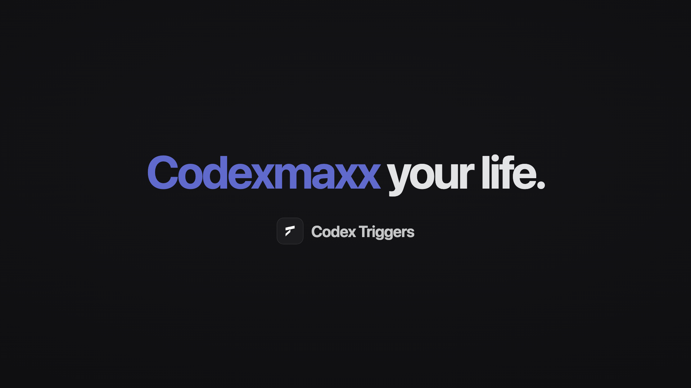

# Codex Triggers

**Let anything trigger Codex.** Webhooks, schedules, watchers — even your
iPhone. Codex Triggers is a macOS app that turns any event into a Codex task,
automatically.

[](https://ank1015-portfolio-media-3e8fe1.s3.amazonaws.com/codex-triggers-launch.mp4)

▶ [Watch the launch video](https://ank1015-portfolio-media-3e8fe1.s3.amazonaws.com/codex-triggers-launch.mp4) · 🌐 [codex-triggers.vercel.app](https://codex-triggers.vercel.app)

## Install

```sh
npx codex-triggers@latest
```

The installer downloads the release for your Mac, installs it to
`~/Applications/Codex Triggers.app`, signs it locally, and opens it. Re-run the
same command to update; Triggers and settings are preserved.

Requirements: macOS, Node.js 20+, and the [Codex desktop app](https://openai.com/codex)
(Codex Triggers drives its `codex app-server` runtime).

## What it does

Codex only works when you're there to ask. Codex Triggers removes you from the
loop: an event fires, your Trigger code runs, and the result becomes a Codex
task on your machine.

- **Any event in** — public webhook URLs (GitHub, Stripe, iPhone Shortcuts, …),
  cron or one-time schedules, and persistent Service Triggers that watch files,
  networks, or anything else Node can listen to.
- **Codex out** — every notification becomes a templated Codex task with your
  chosen project, model, and reasoning effort. Persistent tasks appear in the
  Codex sidebar; completion notifications deep-link straight back to them.
- **Created by asking Codex** — the app bundles the `manage-codex-triggers`
  skill. Press *Ask Codex* (or pick an idea from the catalog), describe the
  automation in plain language, and Codex writes the Trigger code, wires the
  Delivery, and tests it.
- **Native to your Mac** — macOS notifications for every run, one-click
  Tailscale Funnel for secure public webhook URLs, and a control center to
  enable, inspect, and tune every Trigger from one place.

Everything runs locally: SQLite is the source of truth, the control API stays
on loopback, and only the webhook gateway is ever exposed — behind a secret,
rotatable URL.

## Create your first Trigger

Open a Codex chat and ask, with the bundled skill:

> Review every new PR on `acme/checkout` and leave a review comment.

Codex confirms the settings, creates the Trigger system, registers the
webhook, and tests it. From the app you can then toggle it, switch the Codex
model or reasoning effort, watch recent runs, and jump into any finished task.

The Create page ships with 40 ready-made ideas — screenshot organizing, PR
review, competitor monitoring, Siri "Tell my Mac", receipt snapping, morning
briefings, and more.

## How it works

```text
webhook / schedule / service ──▶ Trigger code (Worker Threads)
                                      │  ctx.notify({ message, data })
                                      ▼
                            durable notification outbox
                                      │  Delivery (templated)
                                      ▼
                        Codex task via codex app-server
```

While the app is running, local processes can use the same runtime:

- Control API: `http://127.0.0.1:47831`
- Webhook gateway: `http://127.0.0.1:47832`

See [ARCHITECTURE.md](./ARCHITECTURE.md) for the Trigger runtime design,
[DELIVERY_ARCHITECTURE.md](./DELIVERY_ARCHITECTURE.md) for Deliveries, and
[`context.md`](./context.md) before operating the API directly.

## Project structure

```text
apps/
├── desktop/             The Codex Triggers macOS app (Electron)
├── landing/             Landing page — https://codex-triggers.vercel.app
└── trigger/             The Trigger runtime the app embeds
packages/
└── codex-triggers/      The `npx codex-triggers` installer
skills/
└── manage-codex-triggers/  The bundled skill Codex uses to manage Triggers
```

## Development

```sh
pnpm install
pnpm desktop        # build and run the app (signed dev bundle, macOS)
pnpm smoke          # desktop end-to-end smoke test
```

The standalone runtime (all three Codex delivery adapters, optional admin
token) can be run without the app:

```sh
pnpm dev            # standalone runtime with live listeners
pnpm funnel         # expose the webhook gateway through Tailscale Funnel
pnpm typecheck && pnpm test && pnpm build
```

Configuration variables are listed in [`.env.example`](./.env.example).
