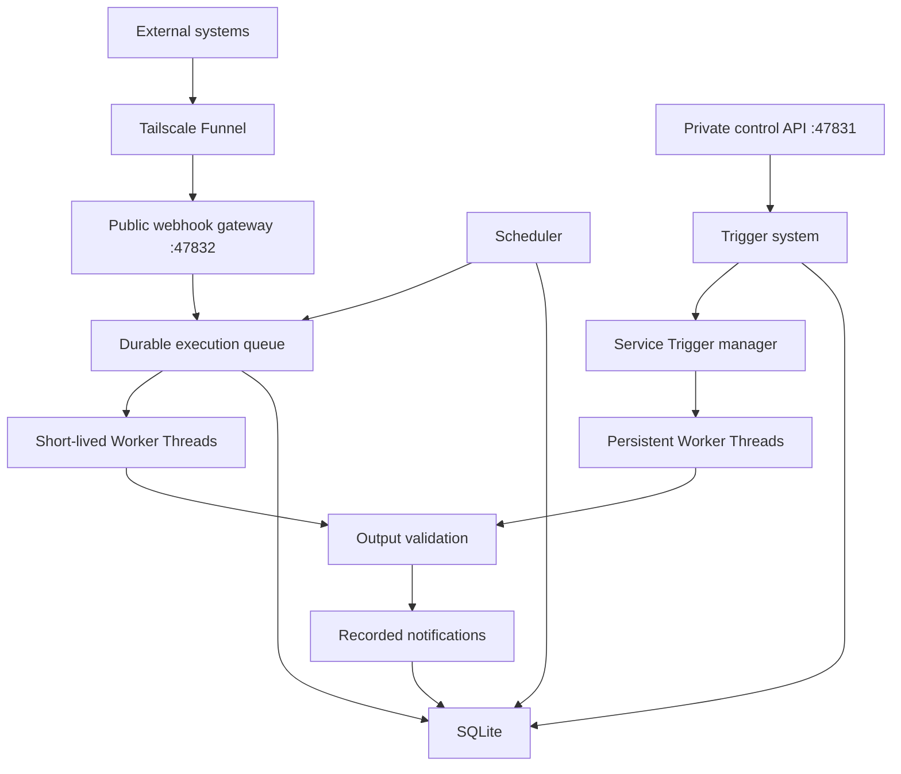

# Trigger System Context

## Purpose of this document

This document is for an agent or developer who has no previous knowledge of
Trigger but needs to create, update, invoke, test, or inspect Triggers through
the API.

Read this document before making API requests. It explains:

1. What Trigger is.
2. Why it exists.
3. How its internal lifecycle works.
4. Which Trigger type to choose.
5. How Trigger code communicates with the host.
6. Every management API and its request format.
7. How to verify that a Trigger actually works.
8. The current security boundaries and limitations.

## What Trigger is

Trigger is a local automation runtime running on one device. It hosts small
TypeScript or JavaScript programs called **Triggers**.

A Trigger runs for one of three reasons:

- An external system sends an HTTP webhook.
- A cron expression or one-time schedule becomes due.
- A persistent Service Trigger is running and observes something itself.

Trigger code produces one or more structured notifications:

```ts
{
  message: string,
  data: JSONValue,
}
```

The notification system records these outputs in SQLite. A Delivery can follow
one Trigger and create durable jobs that send each new Notification through one
or more predefined Delivery Services. Current Codex adapters are described in
the Delivery system section below.

Trigger is not currently:

- A hosted cloud platform.
- A cloud management application.
- A hostile-code sandbox.
- An external notification provider.
- A replacement for Tailscale.

It is a local process that provides webhook ingress, scheduling, persistent
service supervision, code execution, validation, logging, and durable history.

## Host modes

The same Trigger runtime can be hosted in two ways:

- `pnpm dev` or `pnpm start` runs the standalone Node.js host.
- `pnpm desktop` builds and launches the Electron desktop host.

Both hosts expose the control API on `127.0.0.1:47831` and the webhook gateway
on `127.0.0.1:47832` by default, so other local processes call the same API in
either mode. Do not run both hosts on the same configured ports at once.

The desktop host runs Trigger inside Electron's main process. Its window is a
small status surface; Trigger execution does not happen in the renderer.
Desktop data uses Electron's application data directory unless
`TRIGGER_DATA_DIR` is set. On macOS, closing the window does not stop the
backend; quitting the application does.

Host choice changes only the registered Delivery Services:

- Standalone: `codex-cli`, `codex-app`, and `codex-app-server`.
- Desktop: `codex-app-server` only.

Always call `GET /v1/delivery-services` before creating a Delivery.

## Why Trigger exists

Without Trigger, every automation would need to solve the same operational
problems independently:

- Open and manage an HTTP server.
- Expose webhooks safely.
- Generate and rotate webhook secrets.
- Parse cron expressions and timezones.
- Restore scheduled work after restart.
- Start and stop persistent listeners.
- Restart crashed background services.
- Store configuration and secrets.
- Capture logs and execution history.
- Validate outputs before notification delivery.

Trigger centralizes these responsibilities.

The creator only provides the program-specific code. Trigger owns the process,
ports, persistence, Worker Threads, scheduling, and management API.

## The three Trigger types

### Webhook Trigger

Use a Webhook Trigger when an external service should start an execution by
sending an HTTP request.

Examples:

- GitHub sends a pull request event.
- Stripe sends a payment event.
- A remote script posts a result.
- Another service sends arbitrary JSON.

Webhook Trigger code runs only after a request arrives. It does not remain
running between requests.

### Scheduled Trigger

Use a Scheduled Trigger when code should run at a configured time.

Examples:

- Run every morning at 9:00.
- Check an API every five minutes.
- Send a one-time reminder tomorrow.
- Produce a weekly report.

Scheduled Trigger code is short-lived. The central scheduler creates an
execution when the schedule becomes due.

### Service Trigger

Use a Service Trigger when code must stay alive and listen continuously.

Examples:

- Watch a directory for new files.
- Run a local HTTP or TCP server.
- Maintain a WebSocket connection.
- Listen for database notifications.
- Detect macOS idle, sleep, wake, or application events.
- Subscribe to a message queue.
- Maintain state in memory between events.

Service Trigger code runs in a persistent, host-managed Worker Thread. The
creator writes the listener, but Trigger starts, stops, restores, and restarts
it.

### Selection rule

Choose the narrowest lifecycle that fits:

```text
Only external HTTP requests?  -> Webhook Trigger
Only time-based execution?    -> Scheduled Trigger
Must remain alive/listen?     -> Service Trigger
```

Do not create a Service Trigger merely to receive an ordinary external
webhook. The shared webhook gateway already handles that with less code and
fewer resources.

## High-level architecture



## Starting Trigger

From the repository root:

```sh
pnpm install
pnpm dev
```

Development mode runs the TypeScript source with watch mode.

Production mode:

```sh
pnpm build
pnpm start
```

Trigger currently runs in the terminal. It has not yet been installed as a
macOS `launchd` or login service.

Stop it with `Ctrl+C`. On shutdown Trigger:

1. Stops accepting new HTTP requests.
2. Stops the scheduler.
3. Sends an abort signal to Service Triggers.
4. Waits for Service cleanup.
5. Stops the execution queue.
6. Closes SQLite.

## What starts inside the process

One Node.js OS process starts:

- A private control Hono server.
- A separate public webhook Hono server.
- A durable short-lived execution queue.
- A scheduler poller.
- A Service Trigger supervisor.
- Worker Threads for Trigger code.
- A SQLite connection.

Service creators do not start separate OS processes. Service code runs in
Worker Threads controlled by the Trigger host.

## Ports and network boundaries

Defaults:

| Purpose | Address | Exposure |
|---|---|---|
| Control API | `http://127.0.0.1:47831` | Device only |
| Webhook gateway | `http://127.0.0.1:47832` | May use Tailscale Funnel |

Only port `47832` should be publicly exposed.

Never expose port `47831` through Funnel. It can create, update, start, stop,
and delete arbitrary local code.

Health check:

```sh
curl --fail http://127.0.0.1:47831/health
```

Expected response:

```json
{
  "name": "trigger",
  "status": "ok",
  "triggerCount": 0
}
```

## Tailscale Funnel

With Trigger running:

```sh
pnpm funnel
```

Inspect or remove Funnel configuration:

```sh
pnpm funnel:status
pnpm funnel:reset
```

Set `TRIGGER_PUBLIC_URL` to the HTTPS origin returned by Tailscale before
creating Webhook Triggers. This makes `webhookUrl` in creation responses use the
public origin.

Tailscale is not started automatically by Trigger.

## Configuration

Configuration is read from environment variables when the process starts.

The `.env.example` file is documentation only. `.env` files are not loaded
automatically.

| Variable | Default | Meaning |
|---|---:|---|
| `TRIGGER_DATA_DIR` | Host-specific | SQLite and compiled revision directory |
| `TRIGGER_CONTROL_HOST` | `127.0.0.1` | Control listener host |
| `TRIGGER_CONTROL_PORT` | `47831` | Control listener port |
| `TRIGGER_PUBLIC_HOST` | `127.0.0.1` | Webhook listener host |
| `TRIGGER_PUBLIC_PORT` | `47832` | Webhook listener port |
| `TRIGGER_PUBLIC_URL` | Local URL | URL returned for new webhooks |
| `TRIGGER_ADMIN_TOKEN` | Empty | Optional control API bearer token |
| `TRIGGER_MAX_WEBHOOK_BYTES` | `10000000` | Maximum webhook body size |
| `TRIGGER_JOB_CONCURRENCY` | `4` | Maximum parallel short-lived jobs |
| `TRIGGER_SCHEDULER_INTERVAL_MS` | `500` | Scheduler polling interval |
| `TRIGGER_QUEUE_INTERVAL_MS` | `100` | Queue polling interval |
| `TRIGGER_SERVICE_STOP_TIMEOUT_MS` | `5000` | Service graceful-stop deadline |
| `TRIGGER_CODEX_APP_PATH` | `/Applications/ChatGPT.app` | Codex desktop app bundle |

Example:

```sh
TRIGGER_ADMIN_TOKEN=local-admin-secret \
TRIGGER_PUBLIC_URL=https://device-name.example.ts.net \
pnpm dev
```

The standalone default for `TRIGGER_DATA_DIR` is `data/trigger`. The Electron
desktop default is its per-user application data directory. Every other default
is identical between the two hosts.

## Control API authentication

If `TRIGGER_ADMIN_TOKEN` is configured, every `/v1/*` request requires:

```http
Authorization: Bearer local-admin-secret
```

The `/health` route does not require authentication.

An agent should ask the user for the admin token when the API returns `401`.
Do not search logs, source files, or unrelated environment state for secrets
unless the user explicitly authorizes that.

## Core stored objects

### Trigger

The stable identity and current state:

```ts
{
  id: string
  name: string
  kind: "webhook" | "schedule" | "service"
  enabled: boolean
  activeRevisionId: string
  createdAt: string
  updatedAt: string
}
```

### Trigger revision

An immutable version of executable behavior:

```ts
{
  id: string
  triggerId: string
  version: number
  code: string
  outputSchema: JSONSchema
  timeoutMs: number
  createdAt: string
}
```

Changing code, schema, or timeout creates a new revision. Existing queued
executions stay attached to their original revision.

### Execution

One run or one Service session:

```ts
{
  id: string
  triggerId: string
  revisionId: string
  kind: "webhook" | "schedule" | "manual" | "service"
  status:
    | "queued"
    | "running"
    | "succeeded"
    | "failed"
    | "timed_out"
    | "interrupted"
  input: JSONValue
  error: string | null
  createdAt: string
  startedAt: string | null
  finishedAt: string | null
}
```

### Notification

A validated Trigger output:

```ts
{
  id: string
  triggerId: string
  executionId: string
  output: {
    message: string
    data: JSONValue
  }
  status: "recorded"
  createdAt: string
}
```

`recorded` is the Notification state. Destination-specific progress is stored
separately on Delivery Jobs.

## Delivery system

A Delivery subscribes to one Trigger. Every new Notification from that Trigger
creates one Delivery Job for each configured service while the Delivery is
enabled.

```text
Trigger execution
  -> Notification
  -> matching Deliveries
  -> one job per configured service
  -> predefined service adapter
```

The Notification and its jobs are inserted in one SQLite transaction. External
delivery happens afterward in a background queue, so a slow or failed
destination cannot change a completed Trigger execution to failed.

Always call this endpoint before attempting to create a Delivery:

```http
GET /v1/delivery-services
```

Response:

```json
{
  "services": [
    {
      "type": "codex-cli",
      "configSchema": {},
      "inputSchema": {}
    },
    {
      "type": "codex-app",
      "configSchema": {},
      "inputSchema": {}
    },
    {
      "type": "codex-app-server",
      "configSchema": {},
      "inputSchema": {}
    }
  ]
}
```

The example above is the standalone host response. Trigger Desktop returns only
the `codex-app-server` descriptor. Code should use the response it receives and
must not assume a fixed registry.

Once an adapter is registered, each item includes its `type`, `configSchema`,
and `inputSchema`. A Delivery can then be created with fixed `config` and
Notification-driven `input` templates:

```http
POST /v1/deliveries
Content-Type: application/json

{
  "name": "Handle new items",
  "triggerId": "trigger-uuid",
  "enabled": true,
  "services": [
    {
      "type": "registered-service-type",
      "config": {
        "destinationId": "fixed-destination"
      },
      "input": {
        "title": "New item: {{data.title}}",
        "body": "{{message}}",
        "attachments": "{{data.attachments}}"
      }
    }
  ]
}
```

Templates may appear recursively in strings, arrays, and objects. Available
roots are `{{message}}` and `{{data...}}`. When a whole string is one expression,
the original JSON type is preserved. A missing value fails that individual job
instead of silently becoming an empty string.

### Codex CLI Delivery Service

`codex-cli` is a built-in Delivery Service. It sends a templated prompt
and optional local images to Codex running on this device. It reuses the
device's existing Codex authentication.

Configuration:

```json
{
  "projectPath": "/Users/me/projects/example",
  "newThread": true,
  "model": "luna",
  "reasoningEffort": "medium",
  "sandboxMode": "danger-full-access",
  "networkAccessEnabled": true,
  "timeoutMs": 1800000
}
```

Required fields:

- `projectPath`: project directory, or `""` for the host-managed default
  directory at `data/trigger/codex-workspace`.
- `newThread`: whether every Notification starts a fresh Codex thread.
- `model`: `luna`, `terra`, or `sol`.
- `reasoningEffort`: `low`, `medium`, `high`, `xhigh`, `max`, or `ultra`.

Optional fields:

- `threadId`: existing Codex thread to resume when `newThread` is `false`.
- `sandboxMode`: `read-only`, `workspace-write`, or `danger-full-access`.
  The default is `danger-full-access`.
- `networkAccessEnabled`: whether Codex commands may access the network.
- `timeoutMs`: adapter timeout in milliseconds. Omit it for no timeout.

Input:

```json
{
  "prompt": "Handle {{data.title}}: {{message}}",
  "images": "{{data.images}}"
}
```

`prompt` is required. `images` is an optional array of local image paths. URL
attachments are not downloaded automatically; include their URLs in the prompt
when Codex should inspect them another way.

When `newThread` is `false` and no `threadId` exists, the first thread start
stores the generated thread ID in the configured service. Subsequent jobs
resume it. Calls for the same configured service run sequentially.

The Delivery Job remains running until the Codex turn exits, but its result is
always `null`: final responses, transcripts, completion metadata, and token
usage are not stored. Codex failures are recorded as Delivery Job failures.

### Codex App-Server Delivery Service

`codex-app-server` submits work through one lazily started, Trigger-owned
`codex app-server` process. It does not require the Codex desktop app to be open
and does not create or automate any windows. The process reuses the device's
existing Codex authentication.

Configuration:

```json
{
  "projectPath": "/Users/me/projects/example",
  "newThread": false,
  "model": "luna",
  "reasoningEffort": "medium",
  "threadMode": "persistent"
}
```

Required fields:

- `projectPath`: existing project directory, or `""` for the host-managed
  `data/trigger/codex-workspace` directory.
- `newThread`: whether each Notification creates a fresh thread.
- `model`: `luna`, `terra`, or `sol`.
- `reasoningEffort`: `low`, `medium`, `high`, or `xhigh`.
- `threadMode`: `persistent` or `ephemeral`.

Optional field:

- `threadId`: existing persistent thread to continue when `newThread` is
  `false`.

Input:

```json
{
  "prompt": "Handle {{data.title}}: {{message}}",
  "images": "{{data.images}}"
}
```

`prompt` is required. `images` may contain absolute local image paths or HTTP
and HTTPS image URLs. App-server does not currently expose arbitrary file or
folder attachments; accessible project files should be named in the prompt.

Thread modes:

- `persistent` writes a normal Codex session. With `newThread: false`, the
  first generated ID is saved in the configured service and reused later.
  These threads survive process restarts and are eligible for the desktop app
  sidebar. An already-open app may need to refresh or reload before displaying
  a thread created by another app-server process.
- `ephemeral` writes no session file, never appears in the desktop sidebar, and
  disappears when app-server exits. It requires `newThread: true` and rejects
  `threadId`.

Trigger initializes app-server once over JSONL stdio and shares it across all
configured targets. Approval policy is `never`; sandbox mode is fixed to
`danger-full-access`. If the child exits, the next Delivery starts a new one.
Persistent threads can then be resumed from their stored IDs.

The job succeeds as soon as app-server accepts `turn/start`. Trigger continues
draining protocol events but does not wait for the turn to finish and does not
store responses, transcripts, token usage, or completion status.

### Codex App Delivery Service

`codex-app` submits a templated prompt and optional local attachments through
the real Codex desktop composer. Tasks therefore appear immediately in the
Codex sidebar and have the app's native tools. The adapter reuses the device's
existing Codex authentication.

Configuration:

```json
{
  "projectPath": "/Users/me/projects/example",
  "newThread": false,
  "model": "luna",
  "reasoningEffort": "medium"
}
```

Required fields:

- `projectPath`: existing project directory, or `""` for a projectless task.
  A non-empty directory must already be added as a project in Codex.
- `newThread`: whether every Notification starts a fresh Codex task.
- `model`: `luna`, `terra`, or `sol`.
- `reasoningEffort`: `low`, `medium`, `high`, or `xhigh`.

Optional field:

- `threadId`: existing native Codex task ID to continue when `newThread` is
  `false`.

Input:

```json
{
  "prompt": "Handle {{data.title}}: {{message}}",
  "attachments": "{{data.attachments}}"
}
```

`prompt` is required. `attachments` is an optional array of absolute local file
or folder paths. Paths are attached through the app; remote URLs should be put
in the prompt unless another part of the system first downloads them.

Thread behavior:

- `newThread: true` ignores `threadId` and creates a native task per job.
- `newThread: false` with `threadId` continues that task.
- `newThread: false` without `threadId` creates a task on the first job, stores
  its ID in the configured service, and continues it on later jobs.

The configured project is selected only for a new task. A resumed task keeps
the project to which Codex already assigned it. All `codex-app` targets share
one service-owned Codex window, so UI submissions are serialized even when the
Delivery queue runs multiple jobs concurrently.

The job succeeds after the composer accepts the message and the adapter knows
the task ID. It does not wait for Codex to complete and does not store the
response, transcript, or usage.

If Codex is closed, Trigger launches it normally. It opens the Electron main
process inspector on demand and creates or reuses one invisible, non-focusable
worker window. The worker does not appear in normal window switching. If its
creation activates Codex, Trigger restores the macOS application that was
frontmost before the delivery, unless the user has already switched elsewhere.
Trigger does not force-close the app.

Relevant environment variables:

```text
TRIGGER_CODEX_APP_PATH=/Applications/ChatGPT.app
```

No special Codex launcher is required. The worker is destroyed when Trigger
stops cleanly; a watchdog destroys it if Trigger exits unexpectedly. The local
inspector must not be exposed through Tailscale or another tunnel. Because the
adapter drives private Electron and UI details, a Codex desktop update can
require maintenance.

Delivery management endpoints:

```text
GET    /v1/deliveries
GET    /v1/deliveries?triggerId=:triggerId
POST   /v1/deliveries
GET    /v1/deliveries/:id
PATCH  /v1/deliveries/:id
DELETE /v1/deliveries/:id
```

`PATCH` accepts `name`, `enabled`, or a complete replacement `services` array.
Creating or enabling a Delivery does not replay old Notifications. Disabling it
does not cancel jobs that already exist.

Inspect Delivery Jobs with:

```text
GET /v1/delivery-jobs
GET /v1/delivery-jobs?deliveryId=:deliveryId
GET /v1/delivery-jobs?notificationId=:notificationId
GET /v1/delivery-jobs?status=failed
GET /v1/delivery-jobs/:id
```

Job status is `queued`, `running`, `succeeded`, or `failed`. Failed jobs are
recorded with an error and are not retried automatically. Jobs for different
configured services are independent. Deleting a Delivery retains existing job
history; deleting its Trigger removes the related Notifications and jobs.

## Trigger output contract

Every notification must contain exactly:

```ts
{
  message: string,
  data: JSONValue,
}
```

Recommended form:

```ts
await ctx.notify({
  message: "Issue created",
  data: {
    issueId: "ABC-123",
  },
})
```

Webhook and Scheduled handlers may return one output as shorthand:

```ts
return {
  message: "Issue created",
  data: {
    issueId: "ABC-123",
  },
}
```

`outputSchema` validates the `data` value, not the outer object.

Example schema:

```json
{
  "type": "object",
  "required": ["issueId"],
  "additionalProperties": false,
  "properties": {
    "issueId": {
      "type": "string"
    }
  }
}
```

The corresponding valid output is:

```json
{
  "message": "Issue created",
  "data": {
    "issueId": "ABC-123"
  }
}
```

An invalid output fails the execution and creates no notification.

## Trigger context

All code receives a context object:

```ts
ctx.triggerId
ctx.executionId
ctx.signal
ctx.untilStopped()
ctx.notify({ message, data })
ctx.secrets.get("SECRET_NAME")
ctx.log.debug(...values)
ctx.log.info(...values)
ctx.log.warn(...values)
ctx.log.error(...values)
```

Normal `console.log`, `console.info`, `console.warn`, and `console.error` calls
are captured as execution logs.

Trigger Worker environment variables are empty. Use `ctx.secrets.get()` rather
than expecting values in `process.env`.

Trigger code can use normal APIs such as `fetch`, timers, and Node built-ins.

## Creating a Trigger

All Trigger types use:

```http
POST /v1/triggers
Content-Type: application/json
```

Common request fields:

```ts
{
  name: string
  kind: "webhook" | "schedule" | "service"
  enabled?: boolean
  code: string
  outputSchema?: JSONSchema
  timeoutMs?: number
  schedule?: {
    kind: "cron" | "once"
    expression: string
    timezone: string
  }
}
```

Defaults:

- `enabled` defaults to `true`.
- `outputSchema` defaults to accepting any JSON `data` value.
- Webhook and Scheduled `timeoutMs` default to `30000`.
- Webhook and Scheduled timeouts must be between `100` and `300000` ms.
- Service `timeoutMs` must be `0` or omitted.
- `schedule` is required only when `kind` is `schedule`.

Before saving, Trigger:

1. Validates the request.
2. Validates the JSON Schema.
3. Compiles TypeScript with esbuild.
4. Loads the compiled module in a validation Worker.
5. Confirms that the required `run` or `start` function exists.
6. Stores revision 1 in SQLite.

## Creating a Webhook Trigger

Request:

```json
{
  "name": "Issue webhook",
  "kind": "webhook",
  "enabled": true,
  "code": "export default async function run(request, ctx) { const body = await request.json(); await ctx.notify({ message: `Issue: ${body.title}`, data: body }); }",
  "outputSchema": {
    "type": "object"
  },
  "timeoutMs": 30000
}
```

Supported code shapes:

```ts
export default async function run(request, ctx) {
  // ...
}
```

```ts
export default {
  async run(request, ctx) {
    // ...
  },
}
```

```ts
export async function run(request, ctx) {
  // ...
}
```

Creation response:

```json
{
  "details": {
    "trigger": {},
    "revision": {},
    "webhook": {
      "id": "whk_...",
      "triggerId": "...",
      "createdAt": "...",
      "rotatedAt": null
    },
    "schedule": null,
    "serviceState": null
  },
  "webhookToken": "plaintext-token",
  "webhookUrl": "http://127.0.0.1:47832/hooks/v1/whk_.../plaintext-token"
}
```

The plaintext token is returned only during creation or rotation. Preserve the
returned URL immediately.

### Invoking a Webhook Trigger

```http
ANY /hooks/v1/:endpointId/:token
```

Example:

```sh
curl -X POST '<webhookUrl>' \
  -H 'content-type: application/json' \
  -d '{
    "title": "Something happened"
  }'
```

Immediate response:

```json
{
  "accepted": true,
  "executionId": "execution-uuid"
}
```

The response status is `202`. The arbitrary code runs asynchronously.

### Webhook security

The secret URL token is currently the inbound authentication mechanism.

There is no domain allowlist. Domain-like headers such as `Origin` and
`Referer` are not a reliable server-to-server security boundary because callers
can forge them.

Treat the complete webhook URL as a secret. If it leaks, rotate it:

```http
POST /v1/triggers/:id/rotate-webhook
```

The previous token stops working immediately.

Unknown endpoints, wrong tokens, disabled Triggers, and deleted Triggers all
return `404`.

The maximum request body is 10 MB by default. Larger requests return `413`.

Before passing the request to Trigger code, the gateway:

- Replaces the secret path with a redacted path.
- Removes the query string.
- Removes the `Authorization` header.
- Removes the `Cookie` header.
- Retains the HTTP method.
- Retains the body.
- Retains other headers.

## Creating a Scheduled Trigger

### Cron

```json
{
  "name": "Morning status",
  "kind": "schedule",
  "schedule": {
    "kind": "cron",
    "expression": "0 9 * * *",
    "timezone": "Asia/Kolkata"
  },
  "code": "export default async function run(event, ctx) { const response = await fetch(`https://example.com/status`); await ctx.notify({ message: `Morning status`, data: { scheduledFor: event.scheduledFor, status: response.status } }); }",
  "outputSchema": {
    "type": "object"
  }
}
```

### One-time schedule

```json
{
  "name": "One-time reminder",
  "kind": "schedule",
  "schedule": {
    "kind": "once",
    "expression": "2026-07-20T10:00:00.000Z",
    "timezone": "UTC"
  },
  "code": "export default async function run(event, ctx) { return { message: `Reminder`, data: event }; }"
}
```

Scheduled handlers receive:

```ts
{
  type: "schedule",
  scheduleId: string,
  scheduledFor: string,
  payload?: JSONValue,
}
```

The scheduler polls every 500 ms by default.

For a one-time schedule, `nextRunAt` becomes `null` after firing.

After downtime, the current cron implementation runs one due occurrence and
then advances to the next future occurrence.

## Creating a Service Trigger

Request:

```json
{
  "name": "Local listener",
  "kind": "service",
  "code": "import { createServer } from `node:http`; export default { async start(ctx) { const server = createServer(async (request, response) => { await ctx.notify({ message: `Request received`, data: { path: request.url } }); response.end(`ok`); }); await new Promise(resolve => server.listen(9000, `127.0.0.1`, resolve)); await ctx.untilStopped(); await new Promise(resolve => server.close(resolve)); } }",
  "outputSchema": {
    "type": "object"
  }
}
```

Supported exports:

```ts
export default {
  async start(ctx) {
    // Start listeners.
    await ctx.untilStopped()
    // Clean up listeners.
  },
}
```

```ts
export async function start(ctx) {
  // ...
}
```

Trigger manages:

- Starting the Worker Thread.
- Restoring enabled Services after host restart.
- Passing secrets and notification callbacks.
- Sending the shutdown abort signal.
- Waiting for graceful cleanup.
- Force-terminating after the stop timeout.
- Recording logs and Service session executions.
- Restarting crashes with exponential backoff.

Restart delays are approximately:

```text
1s -> 2s -> 4s -> 8s -> 16s -> 32s -> 60s maximum
```

Service code must clean up watchers, sockets, servers, timers, and other
resources after `ctx.signal` is aborted.

Service code is trusted local code with filesystem and network access. Worker
Threads provide operational isolation, not hostile-code security.

Starting child processes, clusters, additional Worker Threads, or terminating
the host process is unsupported and rejected by source validation as a
guardrail.

## Agent operating workflow

An agent creating a Trigger should use this order:

1. Check `/health`.
2. Determine whether the Trigger is Webhook, Scheduled, or Service.
3. Define the required notification `message` and `data` shape.
4. Write `outputSchema` for `data`.
5. Write the Trigger code.
6. Create the Trigger through `POST /v1/triggers`.
7. Save the returned Trigger ID.
8. For Webhook Triggers, save the one-time webhook URL immediately.
9. Configure required secrets.
10. Test the actual behavior.
11. Poll the execution until it is terminal.
12. Inspect logs and notifications.
13. Leave the Trigger enabled only if it should remain active.

Do not claim completion merely because creation returned `201`.

## Listing and reading Triggers

List:

```http
GET /v1/triggers
```

Read full active details:

```http
GET /v1/triggers/:id
```

Details contain:

```ts
{
  trigger: Trigger
  revision: TriggerRevision
  webhook: WebhookEndpointWithoutToken | null
  schedule: TriggerSchedule | null
  serviceState: ServiceState | null
}
```

## Updating a Trigger

```http
PATCH /v1/triggers/:id
Content-Type: application/json
```

Accepted fields:

```ts
{
  name?: string
  enabled?: boolean
  code?: string
  outputSchema?: JSONSchema
  timeoutMs?: number
  schedule?: ScheduleInput
}
```

Do not send `kind`; a Trigger kind cannot be changed.

Changing `code`, `outputSchema`, or `timeoutMs` creates a new immutable
revision.

Changing a Service Trigger restarts it so the new revision or configuration is
active.

## Revisions and rollback

List revisions:

```http
GET /v1/triggers/:id/revisions
```

Activate an older revision:

```http
POST /v1/triggers/:id/revisions/:revisionId/activate
```

Activating a Service revision restarts that Service.

## Secrets

Secret names must match:

```text
[A-Z][A-Z0-9_]*
```

Set:

```http
PUT /v1/triggers/:id/secrets/API_TOKEN
Content-Type: application/json

{
  "value": "secret-value"
}
```

List configured names without values:

```http
GET /v1/triggers/:id/secrets
```

Delete:

```http
DELETE /v1/triggers/:id/secrets/:name
```

Changing Service secrets restarts the Service.

Secret values are currently stored in local SQLite and are not encrypted at
rest. They are not returned by read APIs.

## Manual testing

Webhook and Scheduled Triggers can be manually run:

```http
POST /v1/triggers/:id/run
Content-Type: application/json

{
  "payload": {
    "test": true
  }
}
```

The wrapper is optional; the entire request body becomes the payload if there
is no `payload` property.

For a Webhook Trigger, Trigger creates a synthetic JSON `POST` request.

For a Scheduled Trigger, Trigger creates a schedule event using the current
time and adds the supplied payload.

Service Triggers cannot use `/run`; start or stop them instead.

Manual run response status is `202`:

```json
{
  "execution": {
    "id": "execution-uuid",
    "triggerId": "trigger-uuid",
    "revisionId": "revision-uuid",
    "kind": "manual",
    "status": "queued",
    "input": {},
    "error": null,
    "createdAt": "...",
    "startedAt": null,
    "finishedAt": null
  }
}
```

## Starting and stopping Service Triggers

```http
POST /v1/triggers/:id/start
POST /v1/triggers/:id/stop
```

These routes change `enabled` and refresh the Service lifecycle.

They return `400` when used on Webhook or Scheduled Triggers.

## Executions and logs

List executions:

```http
GET /v1/executions
GET /v1/executions?triggerId=:triggerId
GET /v1/executions?triggerId=:triggerId&limit=50
```

`limit` must be between 1 and 500.

Read one execution and its logs:

```http
GET /v1/executions/:executionId
```

Response:

```json
{
  "execution": {
    "id": "...",
    "status": "succeeded",
    "error": null
  },
  "logs": [
    {
      "id": 1,
      "triggerId": "...",
      "executionId": "...",
      "level": "info",
      "values": ["received", "42"],
      "createdAt": "..."
    }
  ]
}
```

Terminal statuses:

```text
succeeded
failed
timed_out
interrupted
```

Read `execution.error` whenever an execution is not successful.

## Notifications

List:

```http
GET /v1/notifications
GET /v1/notifications?triggerId=:triggerId
GET /v1/notifications?triggerId=:triggerId&limit=50
```

Response:

```json
{
  "notifications": [
    {
      "id": "notification-uuid",
      "triggerId": "trigger-uuid",
      "executionId": "execution-uuid",
      "output": {
        "message": "Something happened",
        "data": {}
      },
      "status": "recorded",
      "createdAt": "..."
    }
  ]
}
```

## Rotating a webhook

```http
POST /v1/triggers/:id/rotate-webhook
```

The response includes a new `webhookToken` and `webhookUrl`. The previous token
stops working immediately.

## Deleting a Trigger

```http
DELETE /v1/triggers/:id
```

Success returns `204 No Content`.

Deleting a Service Trigger stops its Worker first. Related revisions,
executions, logs, secrets, notifications, endpoint, schedule, and Service state
are removed through SQLite relationships.

## Complete API reference

Private control API:

```text
GET    /health

GET    /v1/triggers
POST   /v1/triggers
GET    /v1/triggers/:id
PATCH  /v1/triggers/:id
DELETE /v1/triggers/:id

GET    /v1/triggers/:id/revisions
POST   /v1/triggers/:id/revisions/:revisionId/activate

POST   /v1/triggers/:id/rotate-webhook
POST   /v1/triggers/:id/run
POST   /v1/triggers/:id/start
POST   /v1/triggers/:id/stop

GET    /v1/triggers/:id/secrets
PUT    /v1/triggers/:id/secrets/:name
DELETE /v1/triggers/:id/secrets/:name

GET    /v1/executions
GET    /v1/executions/:id
GET    /v1/notifications

GET    /v1/delivery-services
GET    /v1/deliveries
POST   /v1/deliveries
GET    /v1/deliveries/:id
PATCH  /v1/deliveries/:id
DELETE /v1/deliveries/:id
GET    /v1/delivery-jobs
GET    /v1/delivery-jobs/:id
```

Public API:

```text
ANY /hooks/v1/:endpointId/:token
```

## HTTP errors

### `400 Bad Request`

Possible causes:

- Invalid JSON.
- Missing required fields.
- Invalid Trigger kind.
- Invalid cron expression or timezone.
- Schedule supplied to a non-Scheduled Trigger.
- Invalid timeout.
- Invalid JSON Schema.
- Unknown Delivery Service or invalid Delivery Service configuration.
- Trigger code does not compile.
- Trigger code exports the wrong contract.
- Invalid secret name or value.
- Starting, stopping, or manually running the wrong Trigger kind.

Typical response:

```json
{
  "error": "Trigger code does not implement the required contract",
  "details": ["Trigger must export a run function"]
}
```

### `401 Unauthorized`

The control API bearer token is missing or incorrect.

### `404 Not Found`

The Trigger, Delivery, Delivery Job, execution, revision, secret, or webhook
does not exist.

For public webhooks, `404` also represents an incorrect token or disabled
Trigger.

### `413 Payload Too Large`

The webhook body exceeds the configured 10 MB default.

### `500 Internal Server Error`

An unexpected host failure occurred. Inspect process logs and execution state.

## Persistence and restart behavior

Default paths:

```text
data/trigger/trigger.db
data/trigger/runtime/revisions/<revision-id>.mjs
```

On startup:

1. Executions left `running` by a previous process are marked `interrupted`.
2. Delivery Jobs left `running` are marked `failed` with a restart error.
3. The execution and Delivery queues process persisted queued work.
4. The scheduler finds due schedules.
5. Enabled Service Triggers are restored.

SQLite uses WAL mode and foreign-key enforcement.

## Verification checklist for an agent

Before reporting that a Trigger is ready:

- Confirm `/health` succeeds.
- Confirm the intended Trigger type is correct.
- Confirm creation returned `201`.
- Record the Trigger ID.
- Record the Webhook URL immediately if applicable.
- Confirm required secret names are configured.
- Invoke or exercise the Trigger.
- Poll the returned execution ID.
- Confirm execution status is `succeeded`.
- Inspect execution logs.
- Confirm the expected notification exists.
- Confirm notification `data` matches the output schema.
- For Service Triggers, confirm `serviceState.status` is `running`.
- Stop test Services that should not remain active.
- Never expose the control port publicly.

## Current limitations

- Delivery adapters currently support Codex CLI, Codex app-server, and Codex
  App.
- Webhook authentication uses the secret URL token only.
- Provider HMAC verification is not implemented.
- Domain and IP allowlists are not implemented.
- Webhook query parameters are currently removed before execution.
- `Authorization` and `Cookie` webhook headers are removed before execution.
- Secrets are not encrypted at rest.
- Service code is trusted rather than securely sandboxed against malicious code.
- Trigger does not automatically start on macOS login.
- There is no UI; management is through HTTP APIs.

## Source landmarks

For agents modifying the implementation rather than merely using the API:

```text
apps/trigger/src/index.ts
  Process startup and the two Hono servers.

apps/trigger/src/http/
  Control and public API routes.

apps/trigger/src/orchestration/trigger-system.ts
  Trigger creation, updates, revisions, webhook admission, and secrets.

apps/trigger/src/orchestration/execution-queue.ts
  Durable short-lived job execution.

apps/trigger/src/orchestration/scheduler.ts
  Cron and one-time schedule dispatch.

apps/trigger/src/orchestration/service-manager.ts
  Persistent Service lifecycle and restart backoff.

apps/trigger/src/runtime/
  TypeScript compilation and Worker Thread host/runner.

apps/trigger/src/persistence/database.ts
  SQLite schema and persistence operations.

apps/trigger/src/domain/
  API input validation, shared types, and output validation.

apps/trigger/src/delivery/
  Delivery types, templates, service registry, SQLite repository, queue, and
  control API routes.
```
